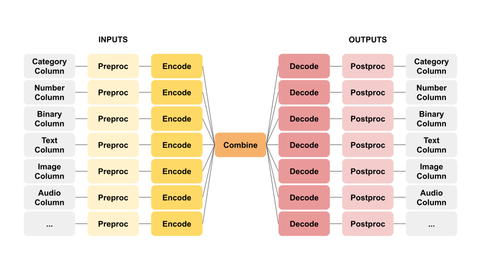

# Ludwig

[Ludwig](https://ludwig-ai.github.io/ludwig-docs/) to uniwersalna biblioteka do trenowania modeli uczenia maszynowego, obsługująca kilkanaście rodzajów modeli. Ludwig to wewnętrzna biblioteka Ubera, która została udostępniona jako otwarte oprogramowanie.

Główne cechy Ludwiga to:
- brak konieczności programowania: cały proces trenowania, ewaluacji i inferencji jest realizowany deklaratywnie
- ogólność: narzędzie się konfiguruje samoczynnie na podstawie deklaracji typów danych, więc rozszerzanie funkcjonalności o nowe typy danych jest relatywnie proste
- elastyczność: biblioteka daje możliwość bardzo precyzyjnego kontrolowania procesu treningu, oferując jednocześnie sensownie dobrane wartości domyślne
- rozszerzalność: dodawanie nowych modeli jest proste

Cała praca z Ludwigiem sprowadza się do właściwego spreparowania pliku z danymi (w formacie `csv`) oraz przygotoaniu jednego pliku konfiguracyjnego w formacie `yaml` (dla osób nie zaznajomionych z YAML-em polecam [krótki tutorial](https://www.cloudbees.com/blog/yaml-tutorial-everything-you-need-get-started/)). Najciekawszym pomysłem w Ludwigu jest oparcie przetwarzania na enkoderach i dekoderach, które są związane z konkretnymi typami danych. W chwili obecnej Ludwig obsługuje następujące typy danych:
- binarne
- numeryczne
- kategoryczne
- zbiory
- sekwencje
- tekst
- przebiegi czasowe (timeseries)
- obrazy
- audio
- daty
- wektory

Ideę przetwarzania w Ludwigu obrazuje poniższy diagram:



Łącząc określony typ wejścia z określonym typem wyjścia otrzymujemy konkretny rodzaj modelu:
- tekst + kategoryczny = klasyfikacja tekstu
- obraz + kategoryczny = klasyfikacja obrazu
- obraz + tekst = opis obrazu (image captioning)
- audio + binarny = weryfikacja mówcy 
- text + sekwencja = NER
- kategoryczny, numeryczny, binarny + numeryczny = regresja
- przebieg czasowy + numeryczny = forecast
- kategoryczny, numeryczny, binarny + binarny = fraud detection

## Klasyfikacja tekstu

Na początek przygotujemy zbiór danych zawierający dwa rodzaje tweetów: tweety dotyczące pandemii COVID-19 oraz tweety ogólne. Naszym zadaniem będzie wytrenowanie modelu który może rozpoznawać tweety o pandemii.

Uruchom trenowanie modelu korzystając z poniższego polecenia:

```bash

ludwig train --dataset data/tweets/tweets.csv \
    --config '{input_features: [{name: tweet, type: text}], output_features: [{name: label, type: category}]}'
```

Oczywiście specyfikowanie konfiguracji treningu w linii poleceń szybko staje się kłopotliwe. Utwórz nowy plik `model-tweets.yaml` i umieść w nim poniższą treść:

```yaml
input_features:
    -
        name: tweet
        type: text

output_features:
    -
        name: label
        type: category

training:
    batch_size: 64
    epochs: 5
```

Uruchom trenowanie modelu korzystając z polecenia:

```bash
ludwig train --dataset data/tweets/tweets.csv \
    --config_file model-tweets.yaml
```

Domyślnym dekoderem dla danych tekstowych jest `parallel_cnn` inspirowany pracą Kima [Convolutional Neural Networks for Sentence Classification](https://arxiv.org/abs/1408.5882). Załóżmy, że zamiast korzystać z konwolucji na poziomie słów, spróbujemy konwolucji na poziomie pojedynczych znaków. W sekcji `input_features` dodaj klucz `level` z wartością `char` i uruchom ponownie trening.

Być może problemem był nie tyle poziom embeddingu tekstu, co raczej sposób podziału na tokeny (ze względu na charakterystykę tokenów spotykanych w tweetach). Powróć do domyślnego poziomu tokenizacji `word` i dodaj w sekcji `input_features` nowy słownik `preprocessing`, w którym umieść informację o preferowanym podziale przez spacje. Właściwy fragment pliku konfiguracyjnego powinien wyglądać następująco:

```yaml
input_features:
    -
        name: tweet
        type: text
        level: word
        preprocessing:
            word_tokenizer: space
```

Dodajmy jeszcze możliwość modyfikacji parametrów uczenia. W sekcji `training` dodaj jeszcze dwa parametry związane z uczeniem oraz zmień kryterium zatrzymania uczenia:

```yaml
training:
    batch_size: 64
    epochs: 5
    decay: True
    learning_rate: 0.001
    validation_metric: accuracy
```

W tej chwili posługujemy się siecią konwolucyjną do kodowania znaków. Zamiast tego możemy spróbować zaaplikować sieć rekurencyjną. Jeszcze niedawno (tj. przed pojawieniem się architektury transformerów) do przetwarzania tekstu wykorzystywano powszechnie sieci rekurencyjne w architekturze LSTM ze względu na ich zdolność do zapamiętywania kontekstu przetwarzanego tekstu. Zmień sekcję `input_features` pliku konfiguracyjnego w taki sposób, żeby wykorzystać enkoder RNN LSTM.

```yaml
input_features:
    -
        name: tweet
        type: text
        level: word
        encoder: rnn
        cell_type: lstm
        preprocessing:
            word_tokenizer: space
```

Ludwig zawiera większość najnowszych modeli językowych dostępnych w module `huggingface`. Pełna lista enkoderów dla tekstu jest dostępna [tutaj](https://ludwig-ai.github.io/ludwig-docs/user_guide/#text-input-features-and-encoders). Na koniec zobaczmy, jak z zadaniem poradzi sobie słynny BERT. Zmień rodzaj enkodera na `bert`.

## Praca z klasycznymi zbiorami danych

Do ilustracji sposobu wykorzystania Ludwiga do klasycznego problemu klasyfikacji posłużymy się znanym zbiorem opisującym pasażerki/ów Titanica. Obejrzyj zbiory danych `data/titanic/train.csv` i `data/titanic/test.csv`.

Następnie przygotuj plik konfiguracyjny `model-titanic.yaml` o następującej postaci.

```yaml
input_features:
    -
        name: Pclass
        type: category
    -
        name: Name
        type: text
    -
        name: Sex
        type: category
    -
        name: Age
        type: numerical
        preprocessing:
          missing_value_strategy: fill_with_mean
    -
        name: SibSp
        type: numerical
    -
        name: Parch
        type: numerical
    -
        name: Ticket
        type: category
    -
        name: Fare
        type: numerical
        preprocessing:
          missing_value_strategy: fill_with_mean
    -
        name: Cabin
        type: category
    -
        name: Embarked
        type: category

output_features:
    -
        name: Survived
        type: binary
```

Uruchom trening modelu wykonując polecenie:

```bash
ludwig train --dataset data/titanic/train.csv --config_file model-titanic.yaml
```

Spróbujmy dokonać niewielkich modyfikacji w definicji modelu:

- dla atrybutu `Pclass` zmień sposób kodowania na one-hot (`encoder: sparse`)
- zmień rodzaj atrybutu `Sex` na `binary`
- usuń informację o porcie zaokrętowania

a następnie uruchom trening ponownie, tym razem jawnie wskazując miejsce zapisania modelu:

```bash
ludwig train --dataset data/titanic/train.csv --config_file model-titanic.yaml \
    --output_directory results/titanic
```

W kolejnym kroku przetestujemy model korzystając z polecenia `experiment`. Zanim uruchomisz poniższe polecenie, dodaj do pliku konfiguracyjnego ograniczenie treningu do 10 epok.

```bash
ludwig experiment --k_fold 5 --dataset data/titanic/train.csv --config_file model-titanic.yaml
```

Obejrzyj wyniki eksperymentu.

W następnym kroku zwizualizujemy proces uczenia.

```bash
ludwig visualize --visualization learning_curves \
    --training_statistics results/titanic/experiment_run/training_statistics.json
```

## Klasyfikacja obrazów

Do przedstawienia sposobu pracy z obrazami wykorzystamy prosty problem klasyfikacji kształtów. W zbiorze danych masz przygotowane zdjęcia okręgów, trójkątów i kwadratów. Przygotuj plik `model-images.yaml` z następującą definicją modelu:

```yaml
input_features:
    -
        name: image_path
        type: image
        encoder: stacked_cnn
        preprocessing:
            resize_method: crop_or_pad
            width: 128
            height: 128

output_features:
    -
        name: label
        type: category

training:
    batch_size: 8
    epochs: 25
```

a następnie uruchom trening modelu:

```bash
ludwig train --dataset image-train.csv --config_file model-images.yaml --output results/
```

Obejrzyj wynik procesu uczenia (wskaż właściwy dla siebie katalog ze statystykami treningu)

```bash
ludwig visualize --visualization learning_curves \
    --training_statistics results/experiment_run_2/training_statistics.json
```

W następnym kroku zaaplikujemy wytrenowany model do nowego zbioru danych.

```bash
ludwig predict --dataset image-test.csv --model_path results/experiment_run_25/model/
```

Obejrzyj wyniki zaaplikowania modelu:

```bash
cat results/label_predictions.csv

cat results/label_probabilities.csv
```

Korzystając z linii poleceń możemy łatwo połączyć pliki i sprawdzić, które przykłady zostały błędnie sklasyfikowane.

```bash
paste image-test.csv results/label_predictions.csv
```

## Serwowanie modelu

Ludwig udostępnia też prosty mechanizm, dzięki któremu możemy uruchomić model jako usługę. W tym celu musimy jeszcze doinstalować parę zależności:

```bash
pip install ludwig[serve]
```

a następnie uruchomić serwer:

```bash
ludwig serve --model_path results/experiment_run_25/model --port 8080 --host localhost
```

Po uruchomieniu serwisu można wysyłać do niego żądania:

```bash
curl http://localhost:8080/predict -X POST -F 'image_path=@data/shapes/serve/triangle.png'
```

## Dostęp przez API

Oczywiście cała funkcjonalność Ludwiga jest też dostępna poprzez API. Poniższy przykład pokazuje, w jaki sposób można tego dokonać. 


```python
from ludwig.api import LudwigModel
import pandas as pd

df = pd.read_csv('data/tweets/tweets.csv')
print(df.head())
```

                                                   tweet  label
    0  RT @bayareahausfrau: Inspirationally murdered ...  OTHER
    1  yay signed up for classes for next semester an...  OTHER
    2  EXCLUSIVE: Sybrina Fulton talks #MOW50 and sta...  OTHER
    3  Join #DPAC’s Freedom Drive  4 Sept  London: gr...  OTHER
    4  I love my new layout so fucking much and maybe...  OTHER


    /home/mikolaj/venv/ludwig/lib/python3.8/site-packages/typeguard/__init__.py:917: UserWarning: no type annotations present -- not typechecking tensorflow_addons.layers.max_unpooling_2d.MaxUnpooling2D.__init__
      warn('no type annotations present -- not typechecking {}'.format(function_name(func)))


```python
model_definition = {
    'input_features':[
        {'name':'tweet', 'type':'text'},
    ],
    'output_features': [
        {'name': 'label', 'type': 'category'}
    ]
}

print('creating model')
model = LudwigModel(model_definition, logging_level=25)
print('training model')
train_stats, _, _ = model.train(dataset=df)
```

    creating model
    training model
    Training: 100%|██████████| 6/6 [00:08<00:00,  1.40s/it]
    Evaluation train: 100%|██████████| 6/6 [00:02<00:00,  2.26it/s]
    Evaluation vali : 100%|██████████| 1/1 [00:00<00:00,  2.18it/s]
    Evaluation test : 100%|██████████| 2/2 [00:00<00:00,  6.32it/s]
    Training: 100%|██████████| 6/6 [00:03<00:00,  1.60it/s]
    Evaluation train: 100%|██████████| 6/6 [00:01<00:00,  5.66it/s]
    Evaluation vali : 100%|██████████| 1/1 [00:00<00:00,  6.76it/s]
    Evaluation test : 100%|██████████| 2/2 [00:00<00:00,  6.27it/s]
    Training: 100%|██████████| 6/6 [00:03<00:00,  1.58it/s]
    Evaluation train: 100%|██████████| 6/6 [00:01<00:00,  5.53it/s]
    Evaluation vali : 100%|██████████| 1/1 [00:00<00:00,  6.80it/s]
    Evaluation test : 100%|██████████| 2/2 [00:00<00:00,  6.59it/s]
    Training: 100%|██████████| 6/6 [00:03<00:00,  1.60it/s]
    Evaluation train: 100%|██████████| 6/6 [00:01<00:00,  4.97it/s]
    Evaluation vali : 100%|██████████| 1/1 [00:00<00:00,  5.32it/s]
    Evaluation test : 100%|██████████| 2/2 [00:00<00:00,  5.35it/s]
    Training: 100%|██████████| 6/6 [00:03<00:00,  1.60it/s]
    Evaluation train: 100%|██████████| 6/6 [00:01<00:00,  5.49it/s]
    Evaluation vali : 100%|██████████| 1/1 [00:00<00:00,  7.55it/s]
    Evaluation test : 100%|██████████| 2/2 [00:00<00:00,  6.39it/s]
    Training: 100%|██████████| 6/6 [00:03<00:00,  1.52it/s]
    Evaluation train: 100%|██████████| 6/6 [00:01<00:00,  5.23it/s]
    Evaluation vali : 100%|██████████| 1/1 [00:00<00:00,  6.47it/s]
    Evaluation test : 100%|██████████| 2/2 [00:00<00:00,  5.87it/s]
    Training: 100%|██████████| 6/6 [00:03<00:00,  1.57it/s]
    Evaluation train: 100%|██████████| 6/6 [00:01<00:00,  5.45it/s]
    Evaluation vali : 100%|██████████| 1/1 [00:00<00:00,  6.96it/s]
    Evaluation test : 100%|██████████| 2/2 [00:00<00:00,  6.57it/s]
    Training: 100%|██████████| 6/6 [00:03<00:00,  1.60it/s]
    Evaluation train: 100%|██████████| 6/6 [00:01<00:00,  5.60it/s]
    Evaluation vali : 100%|██████████| 1/1 [00:00<00:00,  7.26it/s]
    Evaluation test : 100%|██████████| 2/2 [00:00<00:00,  6.35it/s]
    Training: 100%|██████████| 6/6 [00:03<00:00,  1.61it/s]
    Evaluation train: 100%|██████████| 6/6 [00:01<00:00,  5.38it/s]
    Evaluation vali : 100%|██████████| 1/1 [00:00<00:00,  5.92it/s]
    Evaluation test : 100%|██████████| 2/2 [00:00<00:00,  6.47it/s]
    Training: 100%|██████████| 6/6 [00:04<00:00,  1.50it/s]
    Evaluation train: 100%|██████████| 6/6 [00:01<00:00,  5.38it/s]
    Evaluation vali : 100%|██████████| 1/1 [00:00<00:00,  6.64it/s]
    Evaluation test : 100%|██████████| 2/2 [00:00<00:00,  6.26it/s]
    Training: 100%|██████████| 6/6 [00:03<00:00,  1.57it/s]
    Evaluation train: 100%|██████████| 6/6 [00:01<00:00,  5.62it/s]
    Evaluation vali : 100%|██████████| 1/1 [00:00<00:00,  7.20it/s]
    Evaluation test : 100%|██████████| 2/2 [00:00<00:00,  6.66it/s]
    Training: 100%|██████████| 6/6 [00:04<00:00,  1.50it/s]
    Evaluation train: 100%|██████████| 6/6 [00:01<00:00,  5.30it/s]
    Evaluation vali : 100%|██████████| 1/1 [00:00<00:00,  7.76it/s]
    Evaluation test : 100%|██████████| 2/2 [00:00<00:00,  6.48it/s]
    Training: 100%|██████████| 6/6 [00:04<00:00,  1.42it/s]
    Evaluation train: 100%|██████████| 6/6 [00:01<00:00,  5.53it/s]
    Evaluation vali : 100%|██████████| 1/1 [00:00<00:00,  6.59it/s]
    Evaluation test : 100%|██████████| 2/2 [00:00<00:00,  6.57it/s]
    Training: 100%|██████████| 6/6 [00:03<00:00,  1.62it/s]
    Evaluation train: 100%|██████████| 6/6 [00:01<00:00,  5.68it/s]
    Evaluation vali : 100%|██████████| 1/1 [00:00<00:00,  6.85it/s]
    Evaluation test : 100%|██████████| 2/2 [00:00<00:00,  6.09it/s]


```python
train_stats
```


    {'training': OrderedDict([('label',
                   OrderedDict([('loss',
                                 [0.36279178,
                                  0.36742267,
                                  0.28272825,
                                  0.22077517,
                                  0.17439441,
                                  0.1232968,
                                  0.07279396,
                                  0.032430988,
                                  0.007664288,
                                  0.001047795,
                                  0.00017621486,
                                  4.7910842e-05,
                                  1.9770076e-05,
                                  1.093695e-05]),
                                ('accuracy',
                                 [0.90857947,
                                  0.90857947,
                                  0.90857947,
                                  0.90857947,
                                  0.90857947,
                                  0.90857947,
                                  0.9817159,
                                  1.0,
                                  1.0,
                                  1.0,
                                  1.0,
                                  1.0,
                                  1.0,
                                  1.0]),
                                ('hits_at_k',
                                 [1.0,
                                  1.0,
                                  1.0,
                                  1.0,
                                  1.0,
                                  1.0,
                                  1.0,
                                  1.0,
                                  1.0,
                                  1.0,
                                  1.0,
                                  1.0,
                                  1.0,
                                  1.0])])),
                  ('combined',
                   {'loss': [0.36661884,
                     0.37011126,
                     0.28647992,
                     0.2245692,
                     0.17805052,
                     0.12736644,
                     0.07515206,
                     0.0337648,
                     0.008360519,
                     0.0011691705,
                     0.00020175724,
                     5.600264e-05,
                     2.3307388e-05,
                     1.29300215e-05]})]),
     'validation': OrderedDict([('label',
                   OrderedDict([('loss',
                                 [0.33367786,
                                  0.35157678,
                                  0.2965454,
                                  0.25344798,
                                  0.23245656,
                                  0.2010816,
                                  0.1831422,
                                  0.15213937,
                                  0.13335714,
                                  0.15968205,
                                  0.20513788,
                                  0.2404507,
                                  0.26257992,
                                  0.2763832]),
                                ('accuracy',
                                 [0.92134833,
                                  0.92134833,
                                  0.92134833,
                                  0.92134833,
                                  0.92134833,
                                  0.92134833,
                                  0.92134833,
                                  0.94382024,
                                  0.9325843,
                                  0.92134833,
                                  0.9101124,
                                  0.8988764,
                                  0.8988764,
                                  0.8988764]),
                                ('hits_at_k',
                                 [1.0,
                                  1.0,
                                  1.0,
                                  1.0,
                                  1.0,
                                  1.0,
                                  1.0,
                                  1.0,
                                  1.0,
                                  1.0,
                                  1.0,
                                  1.0,
                                  1.0,
                                  1.0])])),
                  ('combined',
                   {'loss': [0.33367786,
                     0.35157678,
                     0.2965454,
                     0.25344798,
                     0.23245656,
                     0.2010816,
                     0.1831422,
                     0.15213937,
                     0.13335714,
                     0.15968205,
                     0.20513788,
                     0.2404507,
                     0.26257992,
                     0.2763832]})]),
     'test': OrderedDict([('label',
                   OrderedDict([('loss',
                                 [0.3954866,
                                  0.43809187,
                                  0.3278291,
                                  0.29778266,
                                  0.27084392,
                                  0.21546046,
                                  0.20246172,
                                  0.14558356,
                                  0.09570678,
                                  0.085979395,
                                  0.09477514,
                                  0.10353524,
                                  0.109354354,
                                  0.11316972]),
                                ('accuracy',
                                 [0.9045226,
                                  0.9045226,
                                  0.9045226,
                                  0.9045226,
                                  0.9045226,
                                  0.9045226,
                                  0.9045226,
                                  0.9396985,
                                  0.94974875,
                                  0.959799,
                                  0.959799,
                                  0.95477384,
                                  0.95477384,
                                  0.95477384]),
                                ('hits_at_k',
                                 [1.0,
                                  1.0,
                                  1.0,
                                  1.0,
                                  1.0,
                                  1.0,
                                  1.0,
                                  1.0,
                                  1.0,
                                  1.0,
                                  1.0,
                                  1.0,
                                  1.0,
                                  1.0])])),
                  ('combined',
                   {'loss': [0.35760462,
                     0.38750333,
                     0.3065921,
                     0.26745418,
                     0.2428018,
                     0.19430152,
                     0.17987955,
                     0.1313086,
                     0.09213854,
                     0.08567004,
                     0.0945474,
                     0.10322143,
                     0.10905294,
                     0.112855986]})])}


```python
tweets = [
    {'tweet': 'I just had my vaccine shot today!'},
    {'tweet': 'Trump claims serious voter fraud in Nevada'},
    {'tweet': 'EU stops the administration of the Pfizer'}
]

model.predict(dataset=tweets, data_format='dict')
```

    Prediction: 100%|██████████| 1/1 [00:00<00:00, 69.97it/s]


    (  label_predictions  label_probabilities_<UNK>  label_probabilities_OTHER  \
     0             COVID                   0.001400                   0.073866   
     1             OTHER                   0.000074                   0.972226   
     2             COVID                   0.014613                   0.214495   
     
        label_probabilities_COVID  label_probability  
     0                   0.924735           0.924735  
     1                   0.027700           0.972226  
     2                   0.770892           0.770892  ,
     'results')


## Zadanie samodzielne

Zapoznaj się z opisem zbioru danych zawierającego [tweety o amerykańskich liniach lotniczych](https://www.kaggle.com/crowdflower/twitter-airline-sentiment?select=Tweets.csv). Zbiór ten masz dostępny w katalogu `data/airlines/tweets.csv`.

Spróbuj samodzielnie wytrenować jeden z poniższych modeli:

- model sentymentu: przewiduje ogólny wydźwięk tweeta (negative, neutral, positive) na podstawie tekstu tweeta
- model klasyfikacji: przewiduje jakiej linii lotniczej dotyczy dany tweet
- model regresji: przewiduje liczbę re-twetów jakie zdobędzie dany tweet
